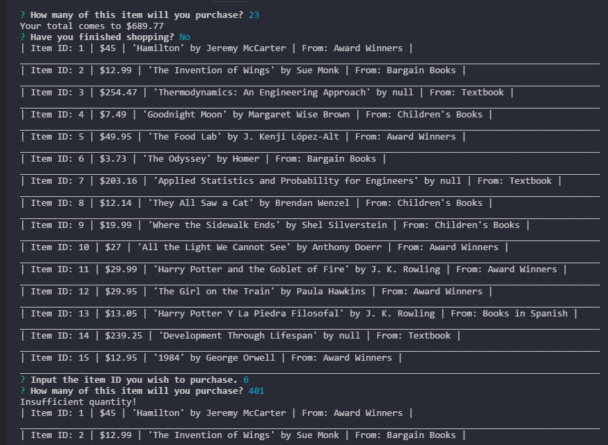
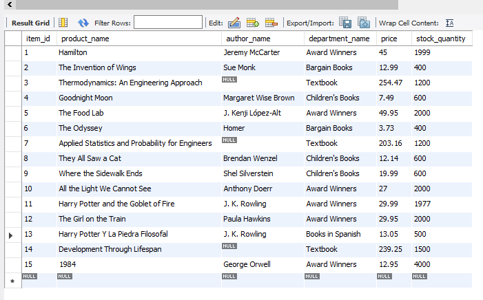

This is the database.

The initial prompt for Bamazon Bookstore to the client

And the redirect to start again if user requests.
Along with the display for "Insufficient quantities.

The way that prompt alters the SQL database.

The way the program escorts the user to exit.

The final image of database after process.

The validation for proper input.
